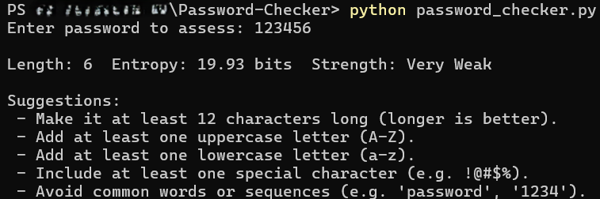
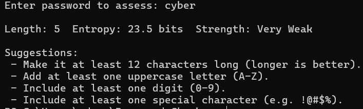
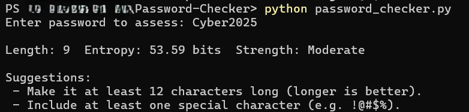
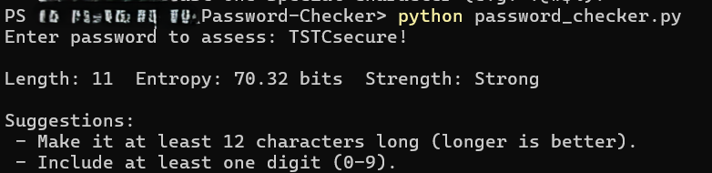

# 🔐 Password Strength Checker

A simple Python tool that evaluates the strength of your password based on:

- ✅ Length (8+ characters)
- ✅ Numbers
- ✅ Uppercase & lowercase letters
- ✅ Symbols (@, $, %, etc.)

## :rocket: How to Run

1. Clone the repo:

   ```bash
   git clone <https://github.com/ehudson92/password-checker.git>

2. Run the script:

   ```bash
   python password_checker.py
   ```

## :brain::scroll:Example Output

Below are real test results from the Password Strength Checker

| Password Example | Strength | Screenshot |
|----------|--------------|-------------|
| 123456 | Very Weak |  |
| cyber | Weak |  |
| Cyber2025 | Moderate |  |
| TSTCsecure!| Strong |  |

## :gear:Technologies Used

- Python
- Regular Expression (re module)

## :bust_in_silhouette: Author

Edward Hudson Jr.

GitHub <https://github.com/ehudson92>

LinkedIn <https://www.linkedin.com/in/edwardhudsonjrofficial>
